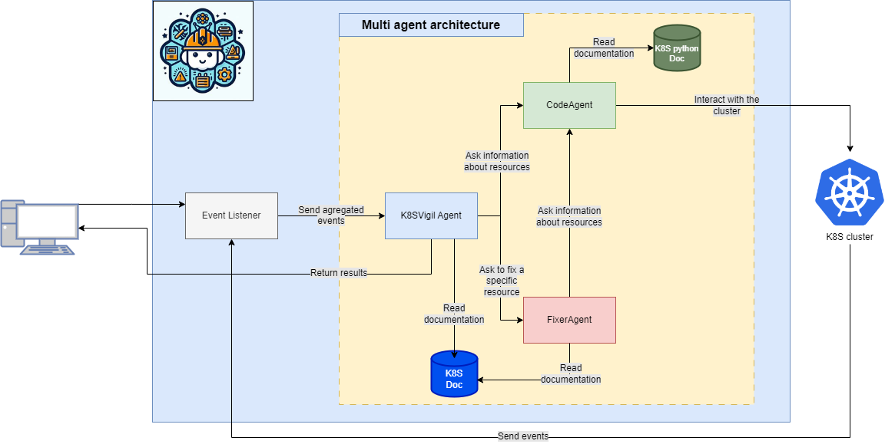

# K8S_ClusterVigil 

K8S ClusterVigil is an event-aware chatbot capable of answering any questions within the cluster. It interacts with the cluster, reads the event history, and provides possible resolutions to encountered issues. This tool offers real-time surveillance, enabling the detection of errors within the system. It utilizes Large Language Models (LLM) to analyze logs, aiding in the identification and debugging of detected errors. This real-time analysis allows for immediate response to issues as they occur, contributing to the efficient management and optimal functioning of Kubernetes clusters.

## Architecture



## Requirements
- Manual login to the cluster
- Installing the dependencies
```
# Use the `-r` flag (without it pip will try to install a package literally
# named "requirements.txt" and fail):
pip install -r requirements.txt
```
## Create the vector DB
```
cd src/
python embed_all.py
```

## Run the gui
```
cd src/
chainlit run cl-async.py
```

## Inspect Langfuse traces locally
The repository includes a small CLI helper for listing Langfuse traces and spotting repeated patterns.

1. Install dependencies (the `langfuse` SDK lives in `requirements.txt`):
   ```bash
   pip install -r requirements.txt
   ```
2. Export your Langfuse credentials (you can also pass them via flags):
   ```bash
   export LANGFUSE_HOST="https://your-langfuse-host"
   export LANGFUSE_PUBLIC_KEY="pk_..."
   export LANGFUSE_SECRET_KEY="sk_..."
   ```
3. Run the script from the repo root to fetch and print traces (you can also filter by environment, user, or trace name):
   ```bash
   python -m src.utils.langfuse_traces \
     --limit 20 --pattern error --environment production --show-io \
     --order-by timestamp.desc
   ```
   The `--order-by` flag must follow Langfuse's `[field].[ASC|DESC]` format (for example `timestamp.desc` or `name.ASC`). If you see a 400 error mentioning `orderBy.order`, double-check the casing and separator.

#### Parameter guide (pick only what you need)
- **Required connection**: `--host`, `--public-key`, and `--secret-key` (or the corresponding `LANGFUSE_*` env vars). These point the script to your Langfuse project and must match the project where traces are generated.
- **Limit**: `--limit 50` controls how many recent traces are fetched (defaults to 50). Raise it if you suspect older traces.
- **Ordering**: `--order-by timestamp.desc` is the default. Use `timestamp.asc` to read from oldest to newest.
- **Environment filter**: `--environment production` only shows traces tagged with that environment. Omit to see every environment.
- **User filter**: `--user-id <USER_ID>` limits results to a specific user in Langfuse.
- **Trace-name filter**: `--name <TRACE_NAME>` filters exact trace names (useful if you know the pipeline name shown in Langfuse).
- **Pattern search**: `--pattern error` performs a substring match over trace name, input, and output payloads for quick pattern recognition.
- **IO printing**: add `--show-io` to include inputs/outputs in the listing; omit for a concise view.

If you see `No traces found with the given parameters`, try removing filters (environment, user, name, pattern) and increasing `--limit` to broaden the query. Also confirm the host and keys point to the same Langfuse project you view in the UI.

### Quick test
To confirm the script is syntactically valid without hitting Langfuse, run:
```bash
python -m compileall src/utils/langfuse_traces.py
```

#### Alternate trace browser focused on metadata
If the main helper returns no results, try the alternate script that mirrors the approach used in `agentops_library-main/evaluation/test_old.py` (it calls `langfuse.api.trace.list` directly and filters client-side):

```bash
python -m src.utils.langfuse_trace_browser \
  --host https://your-langfuse-host \
  --public-key pk_... \
  --secret-key sk_... \
  --limit 50 \
  --metadata-key request_name \
  --metadata-value "<the value shown in Langfuse>" \
  --since-hours 24 \
  --show-metadata
```

- `--metadata-key/--metadata-value` lets you match the exact metadata pair you see in Langfuse (for example, `request_name`).
- `--pattern error` performs a substring search across name/input/output/metadata.
- `--since-hours 24` keeps only traces from the last 24 hours (drop it to scan everything in the fetched batch).
- The script prints how many traces came back from the API before filtering so you can quickly tell whether the credentials/host are working.
